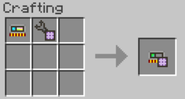
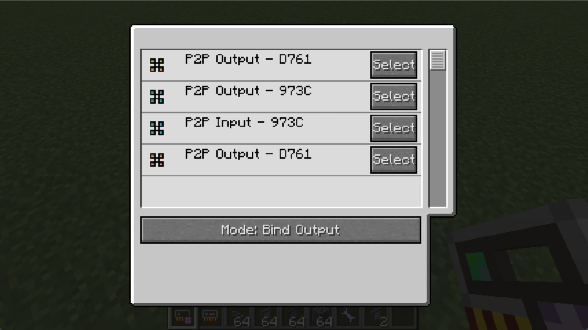
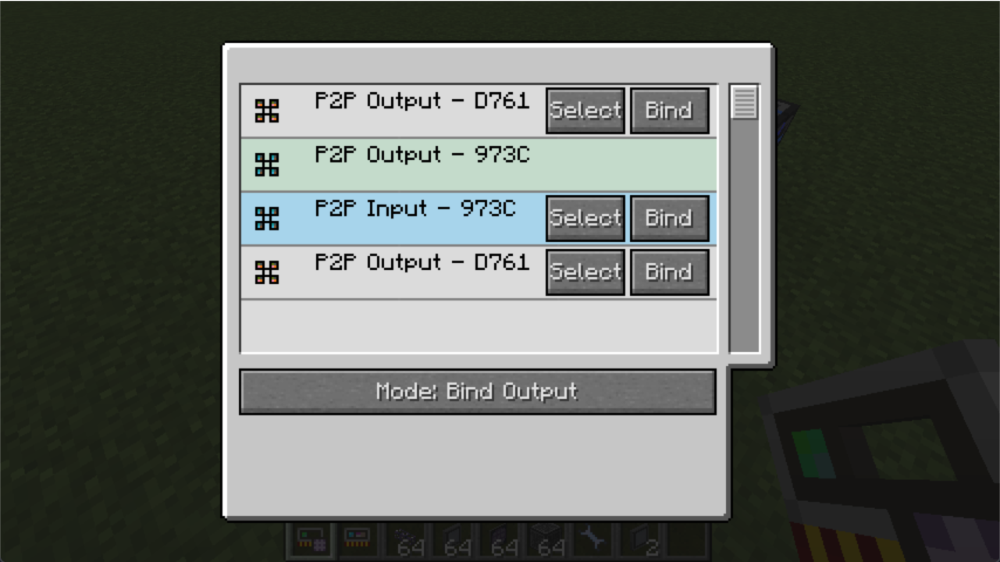
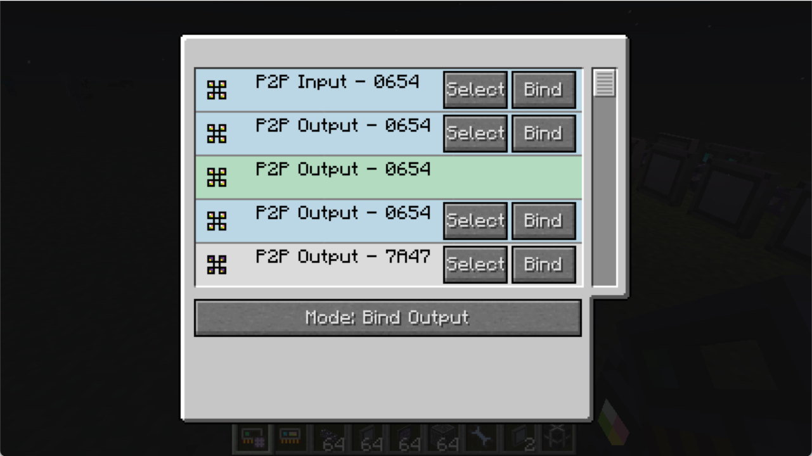
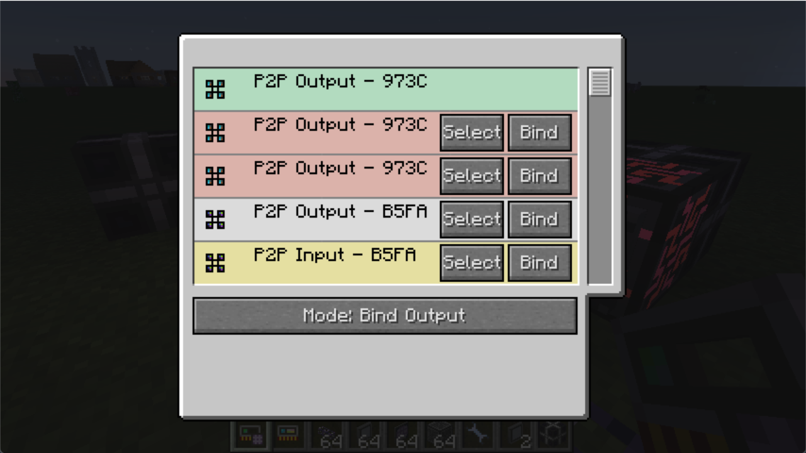
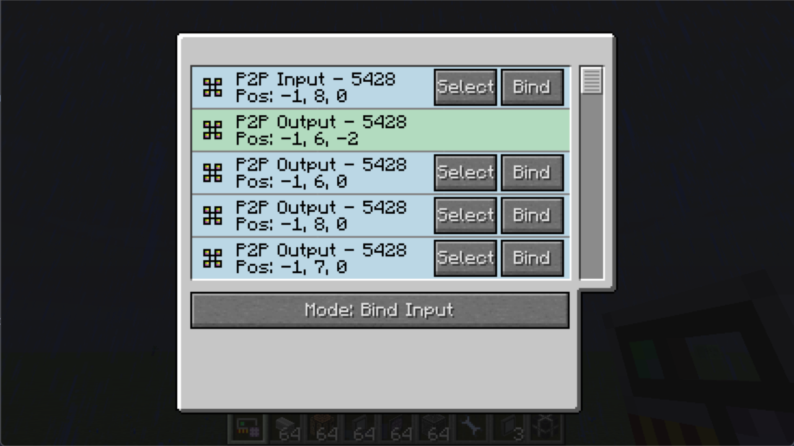
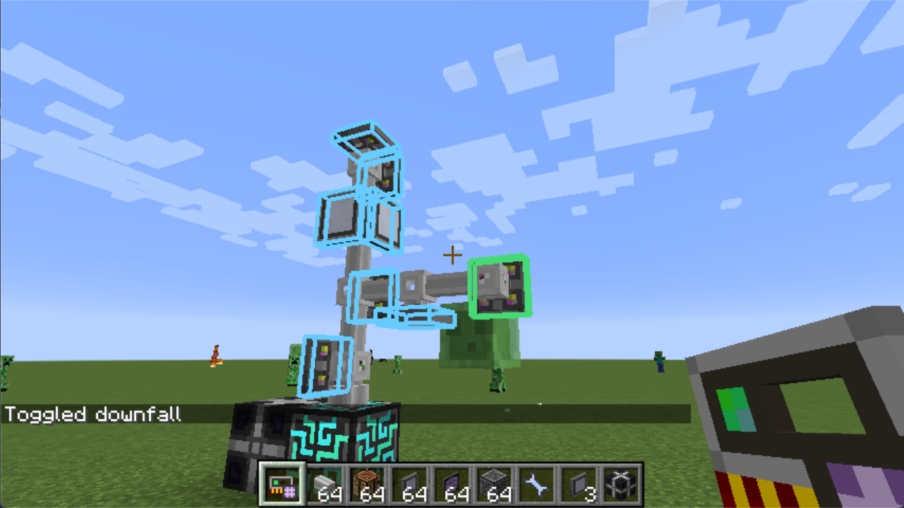

# BetterP2P

  

Better P2P and memory card for Applied Energistics 2, requires [Forgelin](https://www.curseforge.com/minecraft/mc-mods/shadowfacts-forgelin).

Documentation is now available to read: <https://lasmgratel.github.io/BetterP2P-Manual/>

## Features

Obtain a Better Memory Card.

Right-click on a P2P device or any ME attached device to inspect all P2P devices in your ME Network.

Select one of the P2P devices and pair it with other P2P, you can choose the binding mode. Once you have P2P devices paired, devices with same frequency will be highlighted in aqua color.

Input P2P will always be on the top.

A wrong setup (usually P2P devices without input) will be in red color, and devices with no channel will be in yellow.

Version 1.1 update:

P2P location is shown.

When you select one of the P2P device, outlines will render at other devices with same frequency.

You can Shift-click better memory card to clean this outline.

## TODOs

- [ ] Documentation
- [ ] Sort modes
- [ ] Better predicate to reduce crashes
- [ ] Backport to 1.7.10
- [X] A border show in the world to identify the selected P2P device
- [ ] Optimize cache
- [ ] A minimap shows all P2P devices

## Credits

Cyclic for its block outline code
