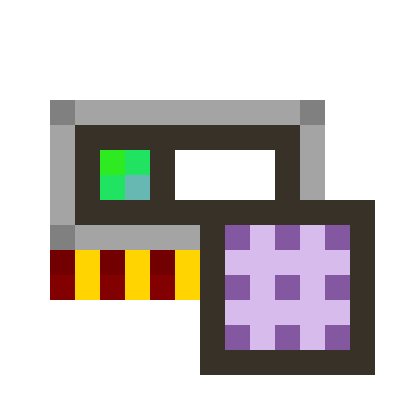

# BetterP2P

   

An advanced tool for AE2, to manage P2P networks.

Supports both **1.20.1 Fabric and Forge!**

**Fabric**: Requires [Architectury API (fabric)](https://modrinth.com/mod/architectury-api/versions?g=1.20.1&l=fabric), [Fabric Language Kotlin](https://modrinth.com/mod/fabric-language-kotlin/versions?g=1.20.1)

**Forge**: Requires [Architectury API (forge)](https://modrinth.com/mod/architectury-api/versions?g=1.20.1&l=forge), [Kotlin for Forge](https://modrinth.com/mod/kotlin-for-forge/versions?l=forge&g=1.20.1)

**Please choose the corrent corresponding dependencies for your mod loader!**

Documentation is now available to read: <https://lasmgratel.github.io/BetterP2P-Manual/>

## Older Versions

1.7.10 Currently Maintained by GTNH Team: <https://github.com/GTNewHorizons/BetterP2P>

1.12.2 Currently Maintained by AE2UEL: <https://www.curseforge.com/minecraft/mc-mods/betterer-p2p>

**All new features and ideas in 1.20 are based on Betterer P2P, thanks AE2UEL Team!**

## TODOs

- [ ] Config
- [ ] Stability Checks

## Credits

- PnC for its block outline code
- LasmGratel for the first BetterP2P
- GlodBlock for the first 1.7.10 port
- firenoo for the big revamps <3
- AE2UEL Team for Betterer P2P
